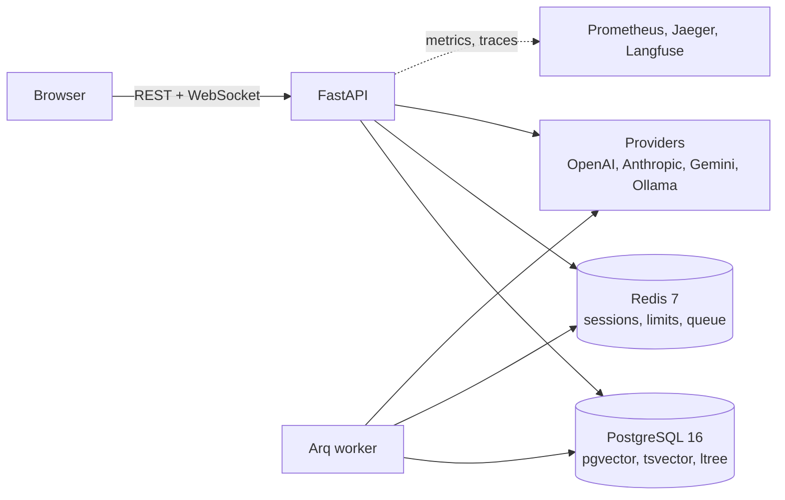

# zk2-rag-platform

A multi-tenant RAG platform: documents in, grounded answers out, with a visual
pipeline editor, tool-using agents, evaluations, A/B experiments and the
observability to tell whether any of it is working.

The interesting part is not that it works, but that every non-obvious decision
is written down next to the code that made it - and that the decisions were
settled by measurement rather than taste.

> **Status:** every planned slice is closed, running at
> <https://rag-platform.reldava.com>. Access is invite-only by design - there is
> no self-signup endpoint to find, so getting in is a link plus an invitation.

---

## What it does

### Sources: getting documents in

Upload a file, add a URL, or import a site's sitemap. Documents live in a tree
of folders backed by Postgres `ltree`, and a bot is pointed at folders rather
than files, so anything added later is included automatically.

Seven formats are parsed: PDF, DOCX, XLSX, HTML, Markdown, JSON and plain text.
Each loader returns **structure, not a wall of text** - the pages and heading
levels the format actually declares. A PDF has no headings, only type, so
headings are read from the type size the document itself uses; Word has
`Heading N` styles; HTML has `<h1>`, and `<main>` beats page chrome.

Chunks are then **packed** to a token budget rather than cut at every boundary,
because a heading says "the subject changes here", not "this is enough text to
answer a question". Every chunk carries the page and heading path it can
honestly claim, which is what lets a citation name a page instead of an
ordinal. Tables of contents are dropped, long character runs are folded, NUL
bytes are stripped before Postgres refuses them.

Chunk size, overlap and strategy are settings, not constants. Changing them -
or shipping a new chunker - marks the corpus stale and offers a reindex.

### Retrieval: finding the right passage

Hybrid, and genuinely so: pgvector for meaning, Postgres full-text for exact
terms, fused by reciprocal rank. Each document is indexed in its **own
language**, detected at ingest, so Russian stemming is applied to Russian text
and English to English. The query is built to match any of its meaningful
words, with stopwords of every configured language stripped first - joining
them all with AND, which is what `plainto_tsquery` does, matches nothing at all
on a real question.

A cross-encoder reranker ships in the image and runs on CPU. Whether it is
worth its second and a half is a question the platform answers about your
corpus rather than in the abstract - see [what measurement settled](#what-measurement-settled).

### Bots and chat

A bot is a system prompt, a model, a set of sources and a retrieval pipeline,
versioned as full snapshots so any past configuration can be restored exactly.

Chat streams over a WebSocket: tokens as they arrive, then the passages that
were retrieved, then which of them the answer actually cited. Green means
cited, grey means retrieved and unused - the difference is visible while you
read. Every citation names its document and page. The token that authenticates
the socket is short-lived and refreshed underneath the conversation.

### Providers

OpenAI, Anthropic, Gemini and Ollama behind one interface, chosen per bot or
per pipeline node. A model catalog carries context windows, capabilities and
prices, so every call is costed as it happens rather than reconstructed later.

Keys are per organization, encrypted with Fernet, write-only through the API.
An organization without its own key draws on the deployment's, up to a token
allowance that indexing counts against as well as chat.

### Pipelines: the graph is data

The retrieval pipeline is a JSON document of nodes and edges that the runtime
executes and a React Flow canvas edits. Seven node types - dense retrieval,
lexical retrieval, fusion, rerank, context builder, generate, agent - each with
its configuration generated from its own JSON Schema, so the form and the
validation come from the same declaration.

Versions are immutable snapshots with labels; one is current and that is what
bots serve. A draft can be run against a real bot before it is saved, and a
graph whose pieces are not joined up is refused rather than quietly answering
without context.

### Agents and MCP

A LangGraph loop with built-in tools - time, calculator, URL fetch, web search,
read-only SQL - plus any MCP server the organization adds. Tool calls and their
results stream to the browser as they happen, and token accounting is kept
in-project rather than trusted to the framework.

### Evals: settling arguments with numbers

A golden set is questions whose answers you already know, with the document
each should come from. It runs through the **real** pipeline - the same
executor a chat turn uses - and scores seven metrics:

| Metric | Judge? | What it sees |
|---|---|---|
| `retrieval_recall` | no | did the expected document reach the prompt at all |
| `context_precision` | no | how much of the prompt came from the right document |
| `citation_rate` | no | did the answer point at what it was given |
| `answered` | no | a non-empty answer that is not a refusal |
| `faithfulness` | yes | is the answer supported by the passages |
| `answer_relevancy` | yes | does it answer the question that was asked |
| `correctness` | yes | does it match the expected answer |

Deterministic metrics are free; judge metrics cost one model call per item and
are marked accordingly. A run can be pinned to a specific pipeline version, so
two graphs are compared on the same questions with the same bot, and any two
runs can be diffed with the regressions named.

### A/B: the same question on live traffic

Split live conversations between what the bot serves now and a candidate
version. Assignment is sticky per person - nobody watches the bot change
underneath them - and turns, tokens and spend per arm come from the same usage
events billing reads. Starting an experiment pins what the control runs, and an
experiment whose arms are the same graph is refused.

### Security

Own authentication: JWT with refresh rotation, magic links, invitations, RBAC
per organization, lockout on repeated failures. No self-signup endpoint exists
at all - access requests go to a super-admin who approves and invites.

Every user-supplied URL is resolved and checked before it is fetched, so a link
pointing inside the network is refused rather than followed. Provider keys are
encrypted at rest. CORS is an explicit allowlist, CSP is `self`, rate limits
are per IP and per account, and every security-relevant action writes an audit
row.

### Operations

Prometheus metrics, OpenTelemetry traces, Langfuse for prompts and cost,
structured logs correlated by request id, and a Grafana dashboard provisioned
from the repository. Runbooks for incidents, backup and restore, scaling and
key rotation. Multistage images, GitHub Actions, a Helm chart with values per
environment, Terraform for AWS, Playwright end-to-end tests and a Locust load
profile.

---

## Observability: four tools, four questions

They overlap on the surface and answer entirely different things.

| Question | Tool |
|---|---|
| What did the model see, what did it answer, what did it cost? | **Langfuse** |
| Where did the time go inside **this one** request? | **Jaeger** (OpenTelemetry) |
| What is happening across **all** requests, over time? | **Prometheus** |
| What does that look like, and when should somebody be woken up? | **Grafana** |

Langfuse knows meaning and nothing about the database. Jaeger knows time,
including the SQL and HTTP calls Langfuse never sees. Prometheus is the only
one that answers questions about no particular request - the depth of the
ingest queue, the number of open sockets, the error rate this hour, the p95
last Tuesday. Traces are kept for days; metrics for a year.

The working order is: an alert fires (Prometheus), a dashboard says which route
and model (Grafana), one bad request shows where its time went (Jaeger), and if
the answer was wrong rather than slow, its prompt is in Langfuse.

Per-organization spend is deliberately **not** a metric: labels never carry
tenant identity, because a time series per customer is how a metrics backend
dies. That question is answered from `usage_events` in Postgres
([ADR-0010](docs/adr/0010-metric-cardinality.md)).

---

## Architecture

Full diagrams in [`docs/architecture.md`](docs/architecture.md) - context,
containers, components, and the two flows worth reading in sequence.



| Component | Responsibility |
|---|---|
| **FastAPI app** | REST and the chat WebSocket; auth, sources, retrieval, pipelines, agents, evals, A/B, admin |
| **Arq worker** | Everything slow or expensive: indexing, eval runs, MCP health checks |
| **PostgreSQL 16** | The whole domain, plus pgvector for embeddings, tsvector for lexical search and ltree for the source tree |
| **Redis 7** | Sessions, rate limits, the shared-key counter, the job queue |
| **Next.js 15 app** | The product: sources, bots, chat, the pipeline canvas, evals, A/B, admin |

---

## Quick start

Prerequisites: Docker with Compose v2, `make`, Node 22+, `pnpm` 9+, and `uv`
(which brings its own Python 3.12).

```bash
cp .env.example .env
# fill in: APP_SECRET_KEY, DB_PASSWORD, SUPER_ADMIN_EMAIL, SUPER_ADMIN_PASSWORD
# for local mail, point SMTP at the bundled MailHog:
#   SMTP_SERVER=localhost SMTP_PORT=1025 SMTP_USE_SSL=false EMAIL_PASSWORD=

make check         # verify uv, pnpm, docker are installed
make install       # api (uv) and web (pnpm) dependencies
make up            # postgres, redis, mailhog, prometheus, grafana, jaeger, langfuse
make migrate       # apply migrations
make seed          # super-admin + a workspace to sign into
make seed-demo     # optional: documents, a bot, a pipeline, a golden set

make dev-api       # terminal 1 - http://localhost:8000
make dev-web       # terminal 2 - http://localhost:3000
make dev-worker    # terminal 3 - indexing and eval runs
```

Sign in at <http://localhost:3000> with the super-admin from `.env`. Outgoing
mail is caught by MailHog at <http://localhost:8025>.

Without any provider key the app still runs: uploads, the pipeline editor and
the evals UI all work, and chat says which key it needs. Add a key in
**Settings -> Providers**, or set `OPENAI_API_KEY` in `.env` to lend the
deployment's own key up to the configured allowance.

Reranking is on by default and the model is baked into the image, so nothing is
downloaded on the first question. `RERANK_ENABLED=false` turns it off cleanly;
without the `rerank` extra installed locally, retrieval keeps the fused order
rather than failing.

### Where things are while it runs

| | |
|---|---|
| App | <http://localhost:3000> |
| API docs | <http://localhost:8000/docs> (also committed: [`docs/api`](docs/api)) |
| Metrics | <http://localhost:8000/metrics> |
| Grafana | <http://localhost:3001> (dashboard provisioned from the repo) |
| Jaeger | <http://localhost:16686> |
| Langfuse | <http://localhost:3030> |
| MailHog | <http://localhost:8025> |

Prometheus runs in Docker and reaches the host through `host-gateway`, so start
the API with `make dev-api API_HOST=0.0.0.0` when you want it scraped - the
default binds to loopback only. If the target still shows down, the host
firewall is blocking the Docker bridge; everything else works regardless.

## Tests and checks

440 tests. The integration ones run against real Postgres and Redis through
testcontainers rather than mocks, which is how several of the defects in the
plan were found at all.

```bash
make lint          # ruff, ruff format, mypy --strict, eslint, tsc
make test          # pytest with testcontainers, vitest
make e2e           # Playwright against a running stack
make helm-lint     # chart lints and renders for dev, staging, prod
make tf-validate   # terraform validate + fmt
```

## Project structure

```
zk2-rag-platform/
├── apps/
│   ├── api/                 # FastAPI: auth, sources, retrieval, pipelines,
│   │   └── src/zk2/         # agents, evals, A/B, observability
│   └── web/                 # Next.js 15 App Router, React Flow editor, e2e
├── packages/
│   ├── shared-types/        # OpenAPI to TypeScript codegen
│   └── ui-config/           # Tailwind preset
├── infra/
│   ├── compose/             # local stack, Grafana provisioning
│   ├── docker/              # multistage images
│   ├── helm/zk2/            # chart with values per environment
│   ├── k8s/                 # manifests rendered from the chart
│   ├── terraform/           # AWS example: VPC, EKS, RDS, Redis, S3, IRSA
│   └── load/                # Locust profile
└── docs/
    ├── architecture.md      # C4 and sequence diagrams
    ├── adr/                 # 16 architecture decision records
    ├── runbooks/            # incident, backup, scaling, key rotation
    └── api/                 # exported OpenAPI + Redoc page
```

## What measurement settled

The platform exists to turn opinions about retrieval into numbers. Run against
a twelve-question golden set on a real corpus, with the graph pinned so the
arms differed by one thing:

| | passages | cost | correctness | recall | context precision |
|---|---|---|---|---|---|
| no rerank | 5 | $0.00339 | 0.98 | 1.00 | 0.63 |
| no rerank | 3 | $0.00248 | 0.91 | 0.92 | 0.69 |
| rerank | 3 | $0.00247 | 0.98 | 1.00 | 0.78 |

Three passages without the reranker lose a question: the one useful passage for
it sat in fifth place. With the reranker, three passages match the five-passage
baseline on every metric at 27 per cent less input - it puts that passage
first. So the reranker's value is not a better answer at five passages, it is
making three safe, and whether that is worth its second and a half depends on
what the model charges and whether anyone is waiting.

Note the second row: context precision **rose** while every answer metric fell,
because the hardest question dropped out of the average along with its low
score. That is what optimising a single metric looks like from the inside, and
it is why a run reports seven of them. The reasoning is in
[ADR-0016](docs/adr/0016-cpu-reranking.md).

## Decisions worth reading

The [ADRs](docs/adr/) are the point of this repository as much as the code is.
The ones that shaped it most:

- [0002](docs/adr/0002-invite-only-access.md) - no self-signup endpoint exists,
  which is a design, not a feature flag
- [0004](docs/adr/0004-embedding-dimensions.md) - every embedding model is
  normalised to 1536 dimensions, because pgvector will not index wider
- [0010](docs/adr/0010-metric-cardinality.md) - metric labels never carry
  tenant identity; per-organization spend is a database question
- [0011](docs/adr/0011-pipeline-runtime.md) - a topological executor rather
  than LangGraph for acyclic pipelines
- [0013](docs/adr/0013-shared-key-allowance.md) - billing deferred, but the
  shared keys are capped and every token is accounted for
- [0015](docs/adr/0015-structured-ingestion.md) - structure comes from the
  format, and chunks are packed to a budget rather than cut at every heading
- [0016](docs/adr/0016-cpu-reranking.md) - reranking is a small multilingual
  cross-encoder, on CPU, and when it is worth turning on

## Roadmap

Deferred on purpose, each with a reason in the plan:

- **OAuth and TOTP** - the models and tables exist; the endpoints do not
- **Billing** - deferred until there is somebody to bill ([ADR-0013](docs/adr/0013-shared-key-allowance.md))
- **Multimodal** - vision, speech in and out
- **Tool calling for Gemini and Ollama** - the adapters exist, the tool paths do not
- **Authenticated MCP servers** - the SDK routes auth headers through a
  transport that could not be verified without a live authenticated server
- **Table-aware PDF parsing** - a flattened table is still a flattened table;
  measured as costing less than expected, so it waits
- **IDF in lexical ranking** - Postgres has none, so a rare term does not
  outweigh a common one; fusion with dense retrieval covers for it

## License

MIT.
