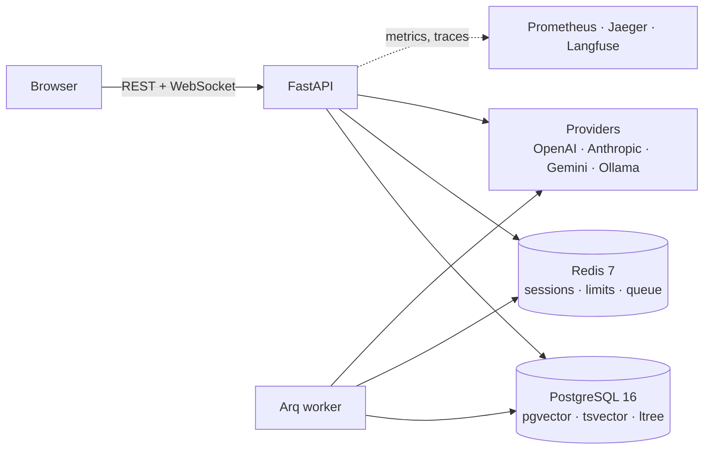

# zk2-rag-platform

Multi-tenant RAG platform: documents in, grounded answers out, with a visual
pipeline editor, tool-using agents, evaluations and full observability.

Built as a portfolio project - the interesting part is not that it works, but
that every non-obvious decision is written down next to the code that made it.

> **Status:** feature-complete through the planned slices (`v0.8`), running at
> <https://rag-platform.reldava.com>. Access is invite-only by design - there is
> no self-signup endpoint to find, so the demo is a link plus an invitation.

## What this demonstrates

| Area | What is actually here |
|---|---|
| **Async Python** | FastAPI, SQLAlchemy 2.0 async over asyncpg, Arq workers, 366 tests on testcontainers |
| **RAG** | Hybrid retrieval (pgvector + Postgres full-text in the document's own language), RRF fusion, optional cross-encoder rerank, structure-aware chunking with breadcrumbs, citation parsing |
| **Multi-provider LLM** | OpenAI, Anthropic, Gemini, Ollama behind one interface, with a model catalog that prices every call |
| **Agents** | LangGraph loop with built-in tools and MCP servers, tool calls streamed to the browser |
| **Visual pipeline builder** | React Flow canvas, node configs generated from JSON Schema, versioning with rollback, test runs against an unsaved draft |
| **Evals and A/B** | Golden sets run through the real pipeline, deterministic and judge metrics, regression comparison, sticky traffic splits with per-variant spend |
| **Security** | Own auth (JWT, magic links, RBAC, lockout), invite-only access, SSRF guard on every user-supplied URL, Fernet-encrypted provider keys, CSP and rate limits, audit log |
| **Observability** | Prometheus metrics, OpenTelemetry traces, Langfuse for prompts and cost, correlated logs, a Grafana dashboard as code |
| **DevOps** | Multistage Docker, GitHub Actions, Helm chart with per-environment values, Terraform for AWS, Playwright e2e, Locust load profile |

## Architecture

Full diagrams in [`docs/architecture.md`](docs/architecture.md) - context,
containers, components, and the two flows worth reading in sequence.



## Quick start

Prerequisites: Docker with Compose v2, `make`, Node 22+, `pnpm` 9+, and `uv`
(which brings its own Python 3.12).

```bash
cp .env.example .env
# fill in: APP_SECRET_KEY, DB_PASSWORD, SUPER_ADMIN_EMAIL, SUPER_ADMIN_PASSWORD
# for local mail, point SMTP at the bundled MailHog:
#   SMTP_SERVER=localhost SMTP_PORT=1025 SMTP_USE_SSL=false EMAIL_PASSWORD=

make check         # verify uv, pnpm, docker are installed
make install       # api (uv) and web (pnpm) dependencies
make up            # postgres, redis, mailhog, prometheus, grafana, jaeger, langfuse
make migrate       # apply migrations
make seed          # super-admin + a workspace to sign into
make seed-demo     # optional: documents, a bot, a pipeline, a golden set

make dev-api       # terminal 1 - http://localhost:8000
make dev-web       # terminal 2 - http://localhost:3000
make dev-worker    # terminal 3 - indexing and eval runs
```

Sign in at <http://localhost:3000> with the super-admin from `.env`. Outgoing
mail is caught by MailHog at <http://localhost:8025>.

Without any provider key the app still runs: uploads, the pipeline editor and
the evals UI all work, and chat says which key it needs. Add a key in
**Settings -> Providers**, or set `OPENAI_API_KEY` in `.env` to lend the
deployment's own key up to the configured allowance.

### Where things are while it runs

| | |
|---|---|
| App | <http://localhost:3000> |
| API docs | <http://localhost:8000/docs> (also committed: [`docs/api`](docs/api)) |
| Metrics | <http://localhost:8000/metrics> |
| Grafana | <http://localhost:3001> (dashboard provisioned from the repo) |
| Jaeger | <http://localhost:16686> |
| Langfuse | <http://localhost:3030> |
| MailHog | <http://localhost:8025> |

Prometheus runs in Docker and reaches the host through `host-gateway`, so start
the API with `make dev-api API_HOST=0.0.0.0` when you want it scraped - the
default binds to loopback only. If the target still shows down, the host
firewall is blocking the Docker bridge; everything else works regardless.

## Tests and checks

```bash
make lint          # ruff, ruff format, mypy --strict, eslint, tsc
make test          # pytest with testcontainers, vitest
make e2e           # Playwright against a running stack
make helm-lint     # chart lints and renders for dev, staging, prod
make tf-validate   # terraform validate + fmt
```

## Project structure

```
zk2-rag-platform/
├── apps/
│   ├── api/                 # FastAPI: auth, sources, retrieval, pipelines,
│   │   └── src/zk2/         # agents, evals, A/B, observability
│   └── web/                 # Next.js 15 App Router, React Flow editor, e2e
├── packages/
│   ├── shared-types/        # OpenAPI → TypeScript codegen
│   └── ui-config/           # Tailwind preset
├── infra/
│   ├── compose/             # local stack, Grafana provisioning
│   ├── docker/              # multistage images
│   ├── helm/zk2/            # chart with values per environment
│   ├── k8s/                 # manifests rendered from the chart
│   ├── terraform/           # AWS example: VPC, EKS, RDS, Redis, S3, IRSA
│   └── load/                # Locust profile
└── docs/
    ├── architecture.md      # C4 and sequence diagrams
    ├── adr/                 # 14 architecture decision records
    ├── runbooks/            # incident, backup, scaling, key rotation
    └── api/                 # exported OpenAPI + Redoc page
```

## Decisions worth reading

The [ADRs](docs/adr/) are the point of this repository as much as the code is.
The ones that shaped it most:

- [0002](docs/adr/0002-invite-only-access.md) - no self-signup endpoint exists,
  which is a design, not a feature flag
- [0004](docs/adr/0004-embedding-dimensions.md) - every embedding model is
  normalised to 1536 dimensions, because pgvector will not index wider
- [0010](docs/adr/0010-metric-cardinality.md) - metric labels never carry
  tenant identity; per-organization spend is a database question
- [0011](docs/adr/0011-pipeline-runtime.md) - a topological executor rather
  than LangGraph for acyclic pipelines
- [0012](docs/adr/0012-agent-runtime.md) - LangGraph for the agent loop, with
  cost accounting deliberately kept out of the framework
- [0013](docs/adr/0013-shared-key-allowance.md) - billing deferred, but the
  shared keys are capped and every token is accounted for

## Roadmap

Deferred on purpose, each with a reason in the plan:

- **OAuth and TOTP** - the models and tables exist; the endpoints do not
- **Billing** - deferred until there is somebody to bill ([ADR-0013](docs/adr/0013-shared-key-allowance.md))
- **Multimodal** - vision, speech in and out
- **Tool calling for Gemini and Ollama** - the adapters exist, the tool paths do not
- **Authenticated MCP servers** - the SDK routes auth headers through a
  transport that could not be verified without a live authenticated server

## License

MIT.
