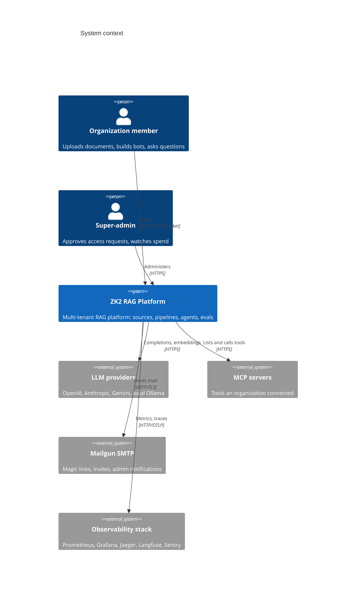
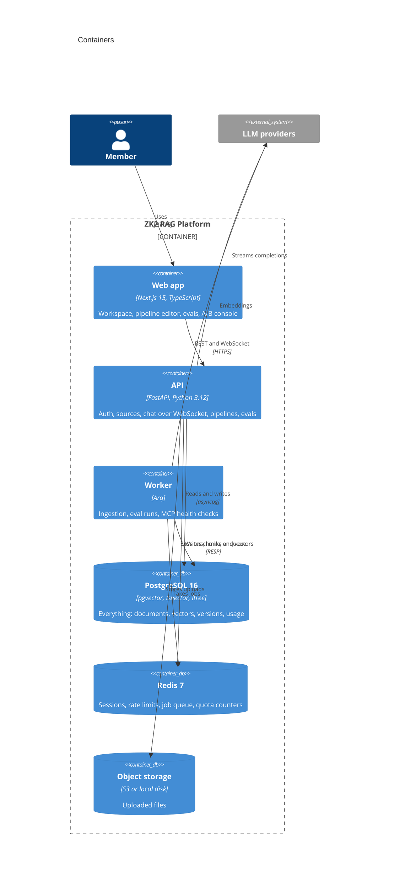
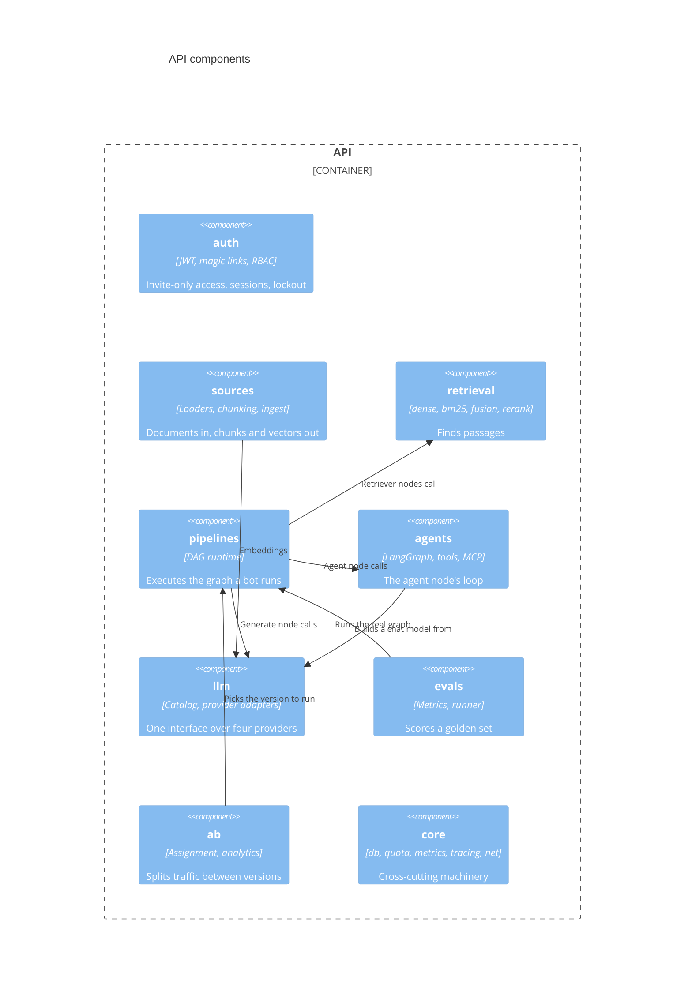
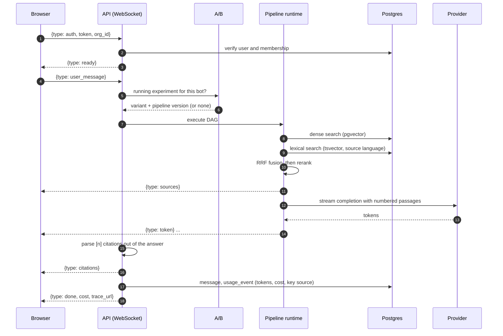
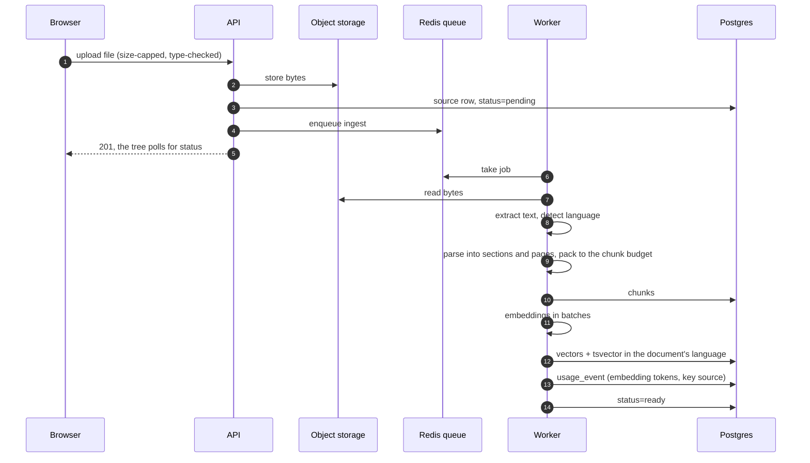

# Architecture

Three C4 levels, then the two paths worth reading in detail: what happens when
someone asks a question, and what happens when they add a document.

## Context

Who talks to the system, and what it talks to.

Access is invite-only by design: there is no self-signup endpoint, so the only
way in is an approved access request (ADR-0002).

## Containers

One database holds documents, vectors, full-text indexes, versions and usage.
pgvector and tsvector next to the rows they describe means retrieval is a join,
not a distributed transaction across two systems (ADR-0003 covers the tree).

## Components inside the API

## A question, end to end

The token expiry is re-checked before every turn, because a socket outlives the
15-minute access token that opened it.

## A document, end to end

A URL source takes the same path, with an SSRF-guarded fetch in place of the
storage read: DNS is resolved and checked before the request, and every
redirect hop is checked again.

## Where the numbers live

| Question | Answer comes from |
|---|---|
| Is the service healthy, how slow is it? | Prometheus, `/metrics`, Grafana dashboard |
| Where did this request's latency go? | OpenTelemetry spans in Jaeger, correlated by `request_id` |
| What did the model see and produce? | Langfuse trace, linked from the chat message |
| What did this organization spend? | `usage_events` in Postgres, `/observability/usage` |
| Did this pipeline change make answers worse? | Eval runs and their comparison |

Metric labels never carry tenant identity - per-organization accounting is a
database question, not a PromQL one (ADR-0010).
